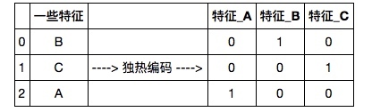
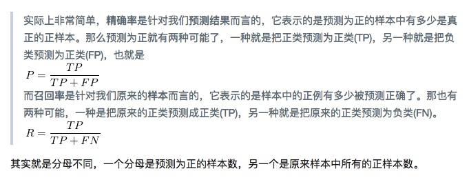

# 知识点总结


1.DataFrame如何添加过滤条件将所需要的数据得出来，可以直接在方括号里添加过滤条件

```python
# TODO：被调查者的收入大于$50,000的人数
n_greater_50k = len(data[data['income'] == '>50K'])

# TODO：被调查者的收入最多为$50,000的人数
n_at_most_50k = len(data[data['income'] == '<=50K'])
```

2.什么是倾斜的连续特征？

有一些很大的值或者很小的值，跟其它数据相差很大

3.对数转换

```python
# 对于倾斜的数据使用Log转换
skewed = ['capital-gain', 'capital-loss']
features_raw[skewed] = data[skewed].apply(lambda x: np.log(x + 1))

# 可视化经过log之后的数据分布
vs.distribution(features_raw, transformed = True)
```

4.什么是规一化？

[归一化](http://baike.baidu.com/link?url=hpDa7sEdKHrbXaE28bhHgYWKNgOCnQVvFTkWOaK5n1fyaDXL_UMmhq9jpTlW2QMe78kB2GkoGiFmkMwQiqzoLm0N5rqnESree2ArJV0u6UT9S4jvrli7WwiQm5Bb9Gsk)

5.如何规一化？

将数据放入一个缩放器中即可

```python
# 导入sklearn.preprocessing.StandardScaler
from sklearn.preprocessing import MinMaxScaler

# 初始化一个 scaler，并将它施加到特征上
scaler = MinMaxScaler()
numerical = ['age', 'education-num', 'capital-gain', 'capital-loss', 'hours-per-week']
features_raw[numerical] = scaler.fit_transform(data[numerical])

# 显示一个经过缩放的样例记录
display(features_raw.head(n = 1))
```

6.什么是独热编码？

独热编码即 One-Hot 编码，又称一位有效编码，其方法是使用N位状态寄存器来对N个状态进行编码，每个状态都有它独立的寄存器位，并且在任意时候，其中只有一位有效。

通常情况下，学习算法期望输入是数字的，这要求非数字的特征（称为类别变量）被转换。转换类别变量的一种流行的方法是使用独热编码方案。独热编码为每一个非数字特征的每一个可能的类别创建一个“虚拟”变量。

假设someFeature有三个可能的取值A，B或者C，。我们将把这个特征编码成someFeature_A, someFeature_B和someFeature_C.




7.如何进行独热编码

[pandas.get_dummies](http://pandas.pydata.org/pandas-docs/stable/generated/pandas.get_dummies.html)

8.准确率(precision),召回(recall)



假设一共有10篇文章，里面4篇是你要找的。根据你某个算法，你认为其中有5篇是你要找的，但是实际上在这5篇里面，只有3篇是真正你要找的。那么你的这个算法的precision是3/5=60%，也就是，你找的这5篇，有3篇是真正对的这个算法的recall是3/4=75%，也就是，一共有用的这4篇里面，你找到了其中三篇。

参考

[如何解释召回率与准确率？](https://www.zhihu.com/question/19645541)
[机器学习性能评估指标](http://charleshm.github.io/2016/03/Model-Performance/)

9.F-beta score 

$$ F_{\beta} = (1 + \beta^2) \cdot \frac{precision \cdot recall}{\left( \beta^2 \cdot precision \right) + recall} $$

10.什么是朴素的预测器

不使用任何信息直接进行预测

通过查看不同类别的数据分布（那些最多赚\$50,000和那些能够赚更多的），我们能发现：很明显的是很多的被调查者年收入没有超过\$50,000。这点会显著地影响**准确率**，因为我们可以简单地预测说*“这个人的收入没有超过\$50,000”*，这样我们甚至不用看数据就能做到我们的预测在一般情况下是正确的！做这样一个预测被称作是**朴素的**，因为我们没有任何信息去证实这种说法。通常考虑对你的数据使用一个*朴素的预测器*是十分重要的，这样能够帮助我们建立一个模型的表现是否好的基准。


11.高斯朴素贝叶斯 (GaussianNB)

[http://www.ruanyifeng.com/blog/2011/08/bayesian_inference_part_one.html](http://www.ruanyifeng.com/blog/2011/08/bayesian_inference_part_one.html)

[朴素贝叶斯分类器的应用](http://www.ruanyifeng.com/blog/2013/12/naive_bayes_classifier.html)

[条件概率](http://baike.baidu.com/link?url=eY2Ef9WmLUVBToEGn570tzCZHsKdS4bVTLW74iO3xZD_w5kVhe8-vUH80mio4gShFg31sQGMH1dvlFgR2qCYLRECAXiSDv6qey5Z6e5WTnbRvDneNLgVGVBnBG2ljuKG)


12.决策树

[决策树算法介绍及应用](http://blog.jobbole.com/89072/)


13.Logistic回归

[用人话解释机器学习中的Logistic Regression（逻辑回归）](http://www.codelast.com/%E5%8E%9F%E5%88%9B-%E7%94%A8%E4%BA%BA%E8%AF%9D%E8%A7%A3%E9%87%8A%E6%9C%BA%E5%99%A8%E5%AD%A6%E4%B9%A0%E4%B8%AD%E7%9A%84logistic-regression%EF%BC%88%E9%80%BB%E8%BE%91%E5%9B%9E%E5%BD%92%EF%BC%89/)

[逻辑回归算法的原理及实现(LR)](http://bluewhale.cc/2016-05-18/logistic-regression.html)

# 小结

P2相关视频把主要的监督学习算法都过了一次，但需要多看几次，多感悟，有些知识还处于比较模糊的状态，似懂非懂。但对完成P2影响并不大，很多细节的东西并不需要在项目中使用，可能这只是一个入门，先往下学，并且后面还得多找找相关项目来做。


